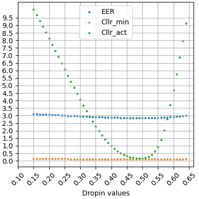
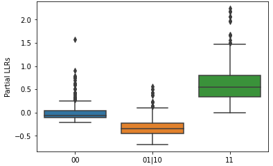
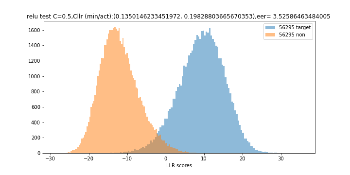
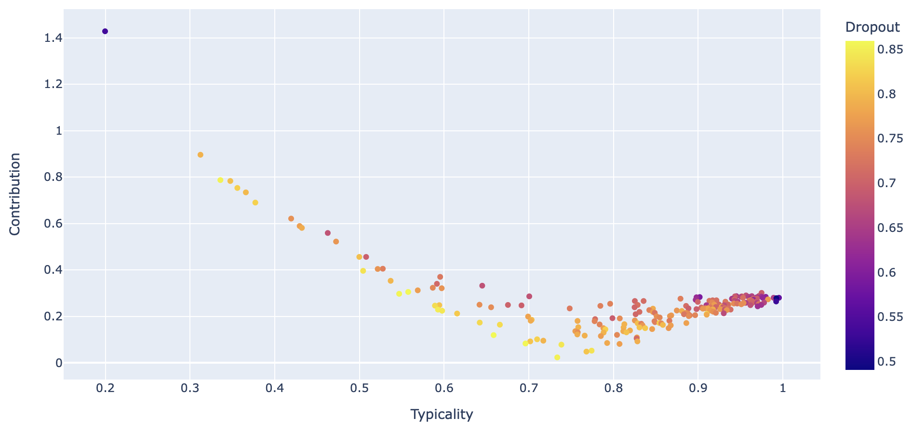
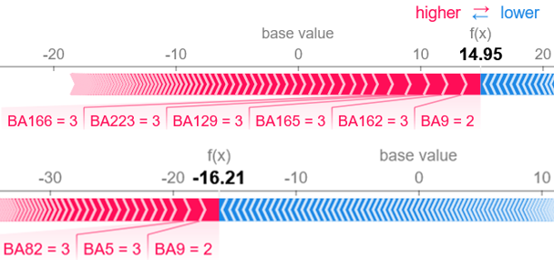

# BA-LR: Toward an interpretable and explainable approach for automatic voice comparison

## Table of content:
* [How it works?](#install)
* [BA-vectors extractor](#extract)
* [BA behavioral parameters](#params)
* [LR Framework](#LR)
* [Interpretability & Explainability](#explain)
* [References](#ref)
## How to install?
To install BA-LR, do the following:

0. Use a conda environment
1. Install requirements:
```sh
pip install -r requirement.txt
```
2. Clone repository:
```sh
git clone https://github.com/Imenbaa/BA-LR.git
```
## BA-vectors extractor
The extractor is trained on Voxceleb2 dataset https://www.robots.ox.ac.uk/~vgg/data/voxceleb/vox2.html. It is composed of a ResNet generator of speech representations optimised for speaker classification task. 
After training phase, we obtain sparse representations (0,x), we replace x to 1 to obtain binary representation. The trained generator parameters are in [model/voxceleb_BA](https://github.com/Imenbaa/BA-LR/tree/main/model/voxceleb_BA/model_dir/).
#### Generator
`Filterbanks -> ResNet generator -> embedding -> Softplus layer() -> Sparse representation`  
#### Speaker Classifier
`Sparse representation -> classifier (i.e. NN projected to num_classes with Softmax) -> class prediction`
#### BA-Vector
`Sparse representation -> BA-vectors`

To extract the trained representations, do the following:
```sh
cd extractor
[TRAIN BAvectors]
python extract.py -m /model/voxceleb_BA/model_dir --checkpoint 2100 -d [WAV_FILES_TRAIN] -f "txt"
[TEST BAvectors]
python extract.py -m /model/voxceleb_BA/model_dir --checkpoint 2100 -d [WAV_FILES_Test] -f "txt"
```

## BA behavioral parameters
Behavioral parameters per BA such as the typicality, typ, and the dropout, dout are calculated based on the train data.
```sh
python BA_params.py --path [TRAIN_DATA]/BAvectors.txt  --typ_path data/typ_BA_soft.txt --dout_path data/dropout_soft.txt
```


The dropin parameter, Din, is related to the noise that could occur in the data. The value of drop-in is tuned on a dedicated set of comparison
pairs extracted from the train corpus, by minimizing the actual Calibrated Log LR, Cllr. The optimised value of dropin
is 0.50 for Cllrmin/act equal to 0.13/0.16 and EER= 2.8. 


## LR Framework
### Partial LRs


### Global LR


## Interpretability & Explainability

If we take a target and a non target voice pair and we try to see the contribution of the different BAs to the final LR decision.
We notice that there are some important BAs that lead the decision and that have the biggest contribution to the LR.
 

To be continued...
## References
For the resnet extractor we used:
https://github.com/Chaanks/stklia

If you use this code, please do not forget to cite our paper where the idea of this approach is firstly introduced and got the best paper award. Thanks!
```BibTex
@inproceedings{Benamor2022,
  title={BA-LR: Binary-Attribute-based Likelihood Ratio estimation for forensic voice comparison
},
  author={Imen Ben Amor, Jean-François Bonastre},
  booktitle={IEEE International Workshop on Biometrics and Forensics 2022},
  year={2022},
  organization={IEEE}
}
```


